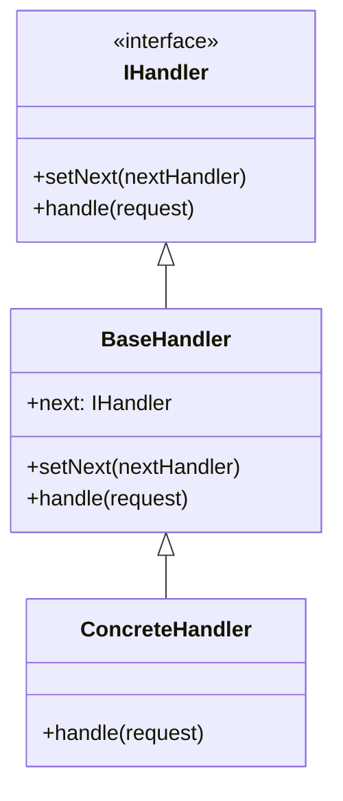
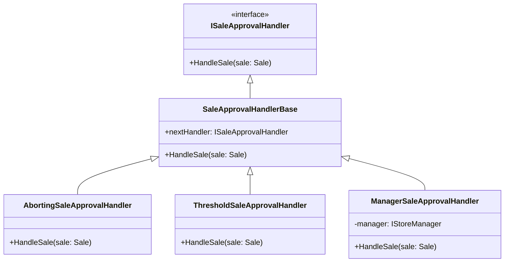

# Chain of Responsibility
Chain of Responsibility is a behavioral design pattern that lets you pass requests along a chain of handlers. Upon receiving a request, each handler decides either to process the request or to pass it to the next handler in the chain.

## Problem
I want a sale to be approved before its processed. For a Sale to be approved it has to undergo several steps in sequential order. If one of these steps approves the sale the following steps don't need to be executed.

## Solution
With the Chain of Responsibility pattern we can link different handler together to form a chain. We can then start at the first handler and pass the sale through to the end or until one handler approves the sale.

## Structure

## My Implementation

Source: https://refactoring.guru/design-patterns/chain-of-responsibility