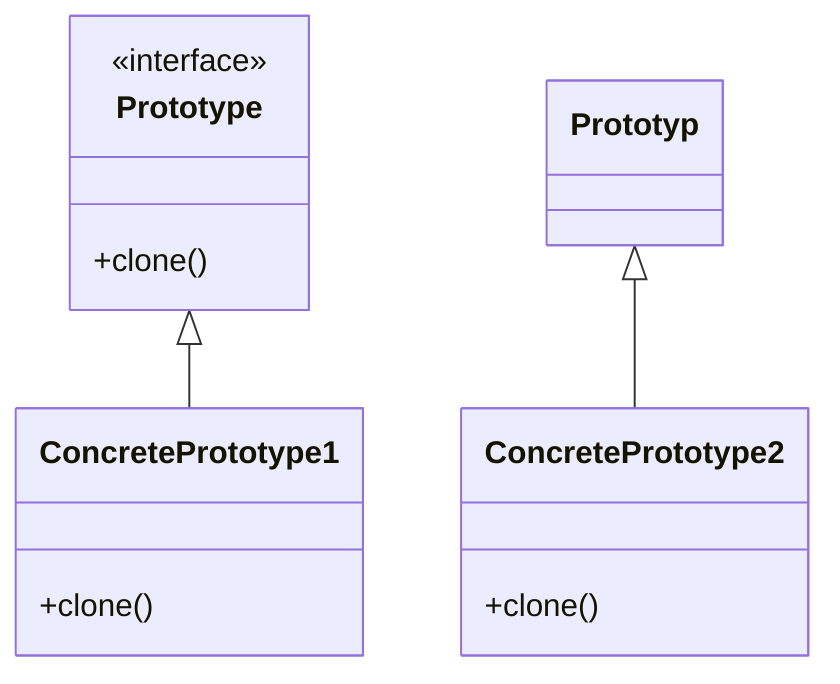
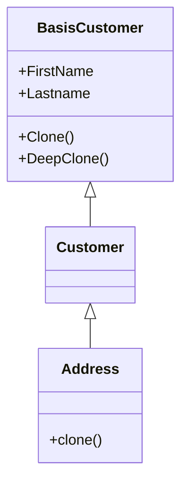

# Prototyp Pattern

## Problem

## Lösung

## UML

```mermaid
classDiagram
    class Prototype
    <<interface>> Prototype
    Prototype: +clone()
    Prototype <|-- ConcretePrototype1
    Prototyp <|-- ConcretePrototype2
    class ConcretePrototype1{
      +clone()
    }
    class ConcretePrototype2{
      +clone()
    }
```

## Meine Lösung
Mit ICloneable

```mermaid
classDiagram
    class BasisCustomer{
        +FirstName
        +Lastname
    }
    BasisCustomer: 
    BasisCustomer: +Clone()
    BasisCustomer: +DeepClone()
    BasisCustomer <|-- Customer
    class Customer
    Customer <|-- Address
    class Address{
      +clone()
    }
```

Source:
* https://en.wikipedia.org/wiki/Prototype_pattern
* https://refactoring.guru/design-patterns/prototype