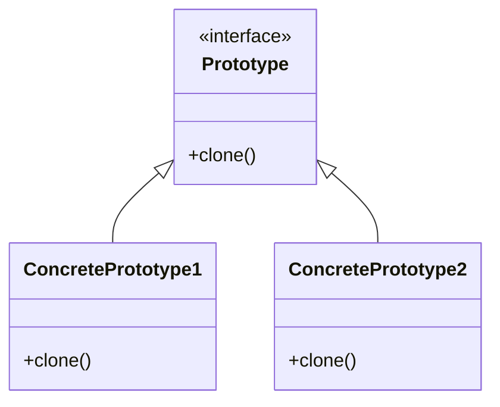
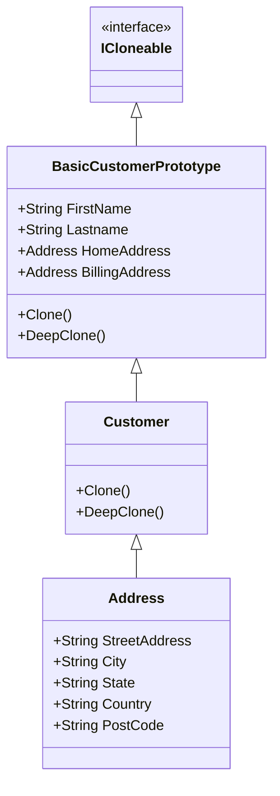

# Prototyp Pattern
Neue Instanzen werden auf Grundlage von prototypischen Instanzen („Vorlagen“) erzeugt. Dabei wird die Vorlage kopiert und an neue Bedürfnisse angepasst.

## Problem
Wie kann sehr ähnliche, jedoch teuer zu instanziierende, Objekte einfach erzeugen ohne grosse parallele Factory-Hierachien aufzubauen.

## Lösung
Erstelle ein Interface mit einer clone()-Methode und verlagere die Objektinstaziierung in die Implementierung der konkreten Subtypen.

## UML

## Meine Lösung
Mit ICloneable

Source:
* https://en.wikipedia.org/wiki/Prototype_pattern
* https://refactoring.guru/design-patterns/prototype